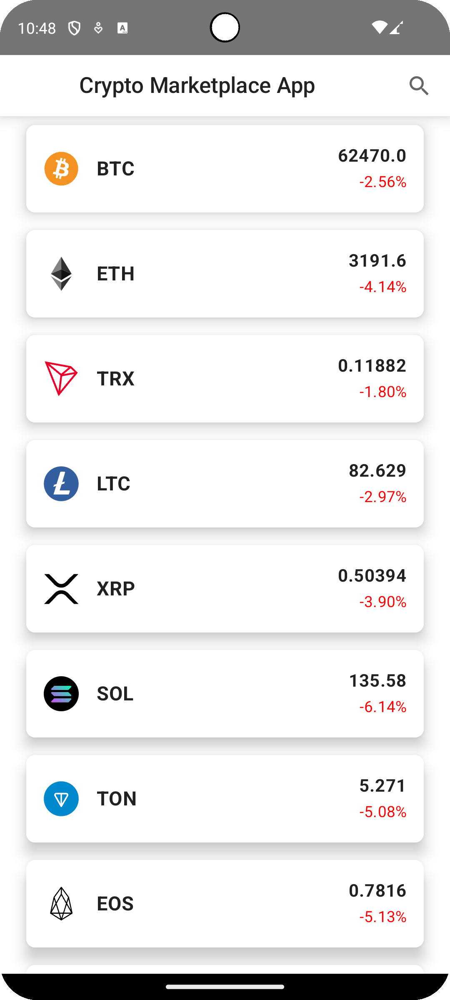

This is a demo project using `Kotlin Multiplatform` with `Compose` for both `Android` and `iOS`.
Previously I never used `Compose` or `Kotlin Multiplatform` for a real-world app, so I decided to use this project as a diving-deep opportunity to get more familiar with these technologies.

The app displays a simple list of cryptocurrencies and their prices by fetching data from the `Bitfinex API`.
It also uses the Github `Cryptofonts` URLs to fetch the icons for each displayed cryptocurrency.

The requirements are the following:
- Data should update every 5 seconds
- The user should be able to filter the list of items via a search bar
- The app should be able to handle connectivity changes
- The UX should be built with the user in mind, ready to be released
- Unit tests should be included for the business logic
- I was free to use any technologies, patterns or libraries I wanted

I used the following technologies:
- `Kotlin Multiplatform` with `Compose` for the UI for both `Android` and `iOS`
- `Ktor` for networking
- `Kotlin Serialization` for JSON parsing
- `Kotlin Coroutines` for asynchronous programming
- `Koin` for dependency injection
- [Kamel image](https://github.com/Kamel-Media/Kamel) for loading and displaying the icons

I went a bit overboard with the project, as I wanted to dive into this new technology as deep as possible, so I included a lot of features that are not necessary for the project's scope.
Some of these are:
- A custom navigation system for the app to go on a details page when the user clicks an item
- A more complex layered architecture that uses the repository and datasource patterns, use cases, and "view models" for the business logic. (I put view models in quotes because they are not the same as the Android ViewModel, but they are similar in the sense that they hold the business logic for the UI.)
- I used Compose for the UI on both platforms which is still in alpha for iOS. I wanted to see how well it works on iOS and if it's worth using it for a real-world app.
- I also implemented a multi-data source system that would be able to fetch data from multiple APIs. This is not necessary for the project, but I let myself get carried away with this feature. I only implemented the Bitfinex API, but I could easily add more APIs in the future.
- The only platform specific code is choosing the networking library for each platform + building the necessary data for setting up the compose `App()`. For networking, I used Ktor for both platforms which abstract away the underlying library.
- Testing via stubbing instead of mocks

Demo image:

